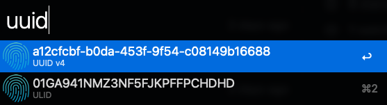
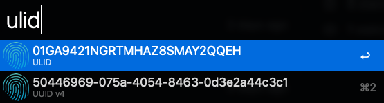
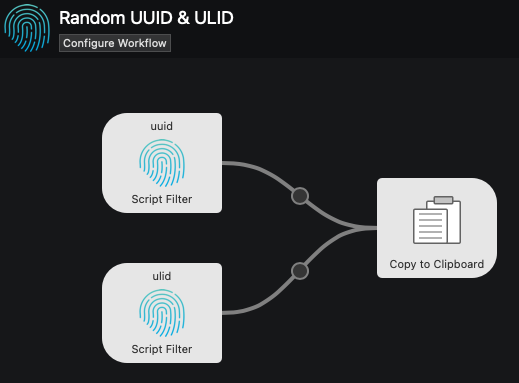

# Alfred UUID & ULID generator workflow

Alfred workflow to generate random UUIDs & ULIDs.

* [UUID](https://github.com/ulid/javascript) - Universally Unique IDentifier (e.g. `01827074-6E45-DF55-2C28-533EC18EAD07`)
* [ULID](https://github.com/uuidjs/uuid) - Universally unique Lexicographically sortable IDentifier (e.g. `01G9R78VJ5VXAJRA2K7V0RXB87`)

### Install

Workflow will appear in Alfred after installing it with npm:

    npm install --global @hoto/alfred-uuid-ulid-generator

### Why use ULIDs vs UUIDs

Example ULID conversion:

    ULID:              01G9R78VJ5VXAJRA2K7V0RXB87
    ULID as UUID v4:   01827074-6E45-DF55-2C28-533EC18EAD07
    ULID as timestamp: 2022-08-06T00:00:54.853Z

ULIDs features:
* Lexicographically sortable (even when converted to UUID v4)
* Compatible with UUIDs 128 format
* Shorter than UUIDs, 26 character string vs 36 characters for UUID
* Encoded using Crockford’s Base32 alphabet (0123456789ABCDEFGHJKMNPQRSTVWXYZ)
    * Excludes I, L, O, and U letters to avoid any unexpected confusion
    * UUID uses hex digits plus hyphens (0-9, A-F)
* The timestamp is accurate to the millisecond

ULID is made up of two base32 encoded numbers, a UNIX timestamp followed by a random number:

    01G9R78VJ5      VXAJRA2K7V0RXB87

    |----------|    |----------------|
    Timestamp          Randomness
    48bits             80bits

### Develop

Create symlink for rapid workflow development:

    npm install -g

<a href="https://www.flaticon.com/free-icons/fingerprint" title="fingerprint icons">Fingerprint icons created by HAJICON - Flaticon</a>
